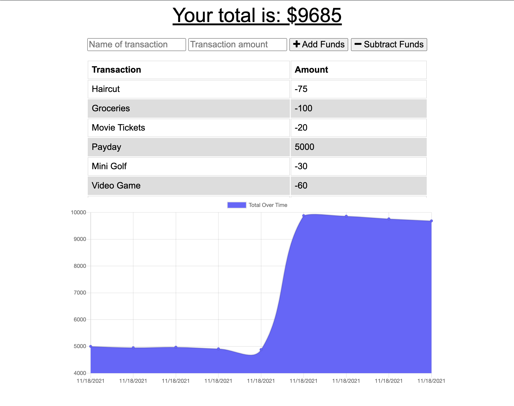

# Budget Tracker

## Description
Add expenses and deposits to your budget with or without an internet connection.

## Table of Contents

- [Installation](#installation)
- [Usage](#usage)
- [Mockup](#mockup)
- [License](#license)
- [Contribution](#contribution)
- [Questions](#questions)

## Installation
Fork this repository and clone it to your local environment. Once cloned, install the necessary dependencies for this project using npm install. This project uses MongoDB so that will also need to be installed on your system.

```
npm i
node server.js or npm start
```

This will launch the server to http://localhost:3000 which you can visit in your browser.

## Usage

This project utilizes JavaScript, Bootstrap, Node, Express, and MongoDB. Functionality includes the ability to add a transaction or deposit, add a description to it, and add transactions and deposits while offline as well.

## Demo

You can find the deployed version of this site [here](https://cryptic-springs-08242.herokuapp.com/).

Upon launch, the tracker will either be blank for a first time user, or will have transactions from a previous use. A basic chart at the top tracks income and expenses and a graph at the bottom of the page tracks a user's income and expenses over time. 



## License

This application is licensed under MIT.

## Contribution

If you'd like to contribute, please add your code and create a pull request.

---

## Questions?
For any questions, please see my GitHub or contact me via e-mail. Thank you!

GitHub: [luminescify](https://github.com/luminescify)

E-mail: ileahd96@gmail.com